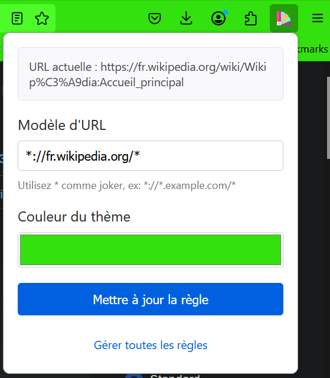
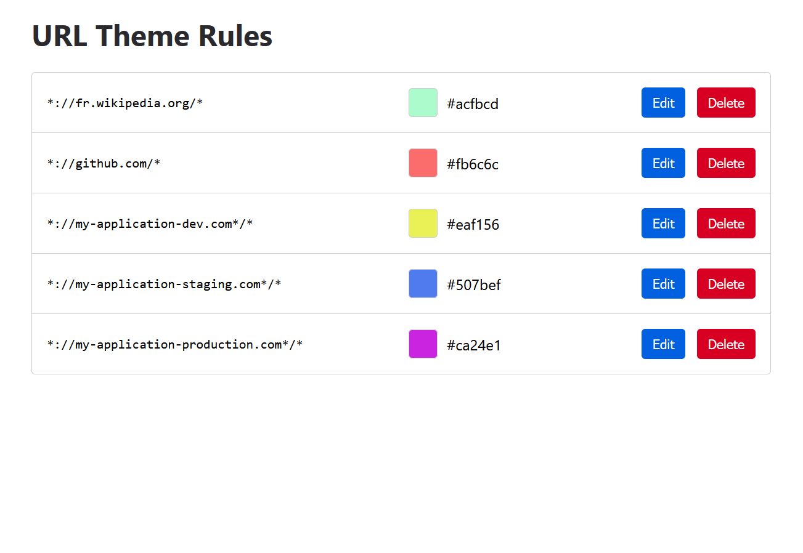

# URL Theme Switcher for Firefox

Automatically change your Firefox theme color based on the current website URL. Perfect for developers and users who work with multiple environments (development, staging, production) or want to visually distinguish between different websites.

## ✨ Features

- 🎨 **Automatic Theme Switching**: Changes Firefox's theme color automatically based on URL patterns
- 🌈 **Real-time Preview**: See color changes instantly while picking colors
- 🔧 **Easy Configuration**: Simple interface to add and manage URL patterns
- 🌍 **Multi-language Support**: Available in English, French, German, Chinese, and Japanese
- 🎯 **Smart URL Patterns**: Support for wildcards and flexible URL matching
- 💾 **Persistent Rules**: Your color rules are saved and automatically applied
- 🔒 **Privacy-Focused**: No data collection, works entirely on your browser

## 🖼️ Screenshots

### Main Popup Interface

### Rules Management

## 🚀 Use Cases

- **Development Environments**
  - Development: Red theme
  - Staging: Yellow theme
  - Production: Green theme

- **Website Categories**
  - Social Media: Blue theme
  - Work-related: Professional gray theme
  - Personal: Custom color theme

- **Multiple Accounts**
  - Personal Gmail: Purple theme
  - Work Gmail: Blue theme

## 📖 How to Use

1. Click the extension icon in your toolbar
2. Enter a URL pattern (e.g., `*.example.com/*`)
3. Choose a color for that URL pattern
4. Click "Add Rule" to save
5. The theme will automatically change when visiting matching URLs

### URL Pattern Examples

- `*://*.example.com/*` - Matches all subdomains of example.com
- `*://dev.*.com/*` - Matches all development environments
- `*://mail.google.com/*` - Matches Gmail specifically
- `*://*.github.com/*` - Matches all GitHub pages

## 🌍 Supported Languages

- English (en)
- Français (fr)
- Deutsch (de)
- 中文 (zh-CN)
- 日本語 (ja)

## 🔒 Privacy

This extension:

- Does not collect any user data
- Does not require any special permissions except for theme management
- Works completely offline
- Is open source and transparent

## 🤝 Contributing

Contributions are welcome! Feel free to:

- Report bugs
- Suggest features
- Add translations
- Submit pull requests

## 📄 License

This project is licensed under the MIT License - see the [LICENSE](LICENSE) file for details.

## 👨‍💻 Author

Created by Jules GF

- GitHub: [@JulioDeLaMurte](https://github.com/JulioDeLaMurte)

---

If you find this extension useful, please consider:
- ⭐ Starring the repository
- 📝 Leaving a review on the Firefox Add-ons store
- 🌟 Sharing with your friends and colleagues 